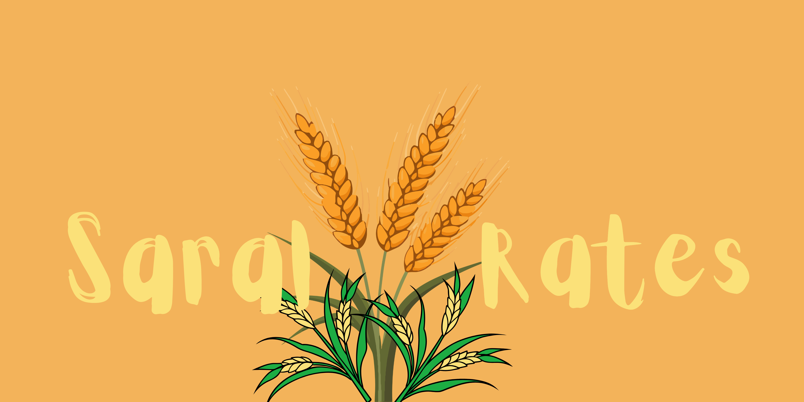
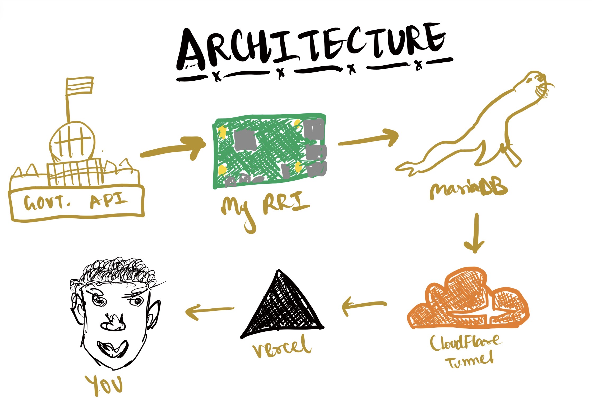

# Saral Rates

Saral Rates is a website for traders and farmers to check prices of different commodities published by the Indian Government daily.

# Features

- So, when you first visit the website, you will be shown all the features of it in brief
- Then you will be shown the dashboard which consists of the header, footer, sidebar and the main region where all the cards and details are displayed
- The sidebar inclues home, favourites, increase, latest favourites (for larger screens only) and decrease
- Home is for seeing all the cards at once obv.
- When you click on favourites, you will see all the bookmarked cards. Max limit is 7 days, so you can see bookmars of up to 7 days
- Then comes the increase section where you can see all the commodities whose prices has increase as compared to a day before
- With same but opposite functionality is the decreased section
- Now on to the header, it consists of logo, theme toggle button and search bar
- You can toggle between two themes - Black and White
- In the search bar you can search any commodity you want, this also works on increase and decrease section
- The footer is not explicitly present on the larger screens but it is shown in the sidebar itself with all the necessary details like the data source, last updated date, version, status of the site, etc.
- Cards include the following things: Commodity name, Variety (not shown if variety is same as commodity name), common price, graphical representation of the commodity's price of at least 4-5 days, the market and district from which the commodity came
- You can also compare two prices, I mean cards by right click on both of them on larger screen devices and if you are on a mobile phone or a devices that responds to touch then just hold onto a card for some time and it'll get selected then again hold onto another card to select the second card
- Comparision will be done on the basis of common price and last 7 days of prices
- Also, you can click on the data.gov.in text to see where I get the data from
- You can filter commodities according the state and their districts too!

# Functionality

- I get data from here a govt API that is, [this](https://www.data.gov.in/resource/current-daily-price-various-commodities-various-markets-mandi)
- My raspberry pi runs cron job daily and stores data in mariaDB which is again on the raspberry pi.
- Pi then through the cloudflare tunnel exposes REST API to the frontend after the data is processed, duplicates are removed, everything else is properly stored into different tables in the DB.
- Then the frontend displays all the cards
- it finally reaches you

# Architecture

# Source

- data.gov.in (Government of India)
- Actual prices may change due to market conditions IRL

# Technologies used

- Reactjs
- TailwindCSS
- Javascript
- NextJS
- MariaDB
- motion.dev
- floating-ui
- react-virtuoso
- react-spinners
- html2canvas
- react-toastify
- lucide-react
- Raspberry Pi

# Current Status

- Version 0.8.2-beta
- Stage: Beta

# Built by

- [Shish Frutwala](https://www.C0nfu5ing-5pring.github.io/Shish/)
